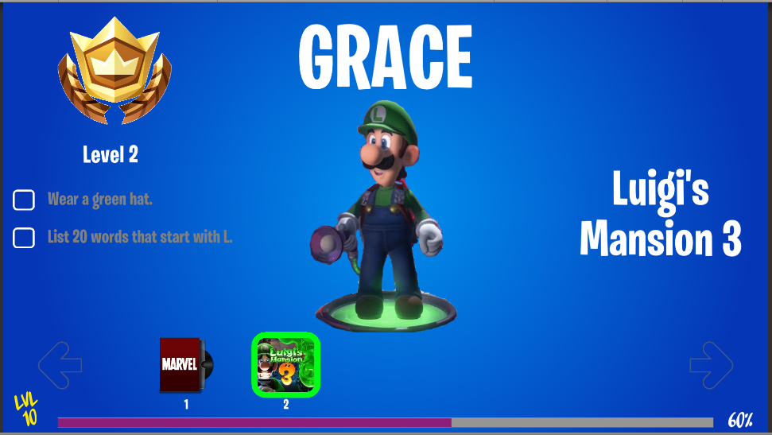

# LearningPass
Fortnite Battle Pass-inspired motivation tool for kids (and their parents)

My 7 year old's skill development in Fortnite exceeds any other example I can think of. A accredit this, in part, to the Battle Pass experience. She's constantly looking at what challenges need to be completed to gain XP, to level up and get "stuff." I started thinking about ways to take these motivation techniques and apply them to experiences that will help her develop important life skills and improve her performance in school. Was there some way to create a Battle Pass for real life? 

After a bunch of brainstorming, the obvious answer came to me. Just give her a Battle Pass user experience, where she and I pick the challenges ourselves. Rather than unlocking a new Emote or Outfit, she unlocks "real life stuff," be it a special snack, or even a new game that we'll buy her.

The content and challenges are managed remotely. JSON is polled periodically to detect changes in XP/progress. The UI updates accordingly.

Success remains to be seen. But she has, so far, responded well to a sneak peek at the alpha version.

    
